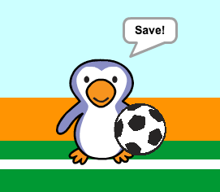

## Was it a goal?

Once the ball has reached the goal, there's a decision to make. __If__ the ball is touching the goalie then it has been saved, __else__ it's a goal.

--- task ---

Add this code to the end of your football sprite code, so that you can check whether the ball is touching the goalie.


```blocks
repeat (15)
change y by (10)
end
+if <touching [goalie v]> then
else
end
```

--- /task ---

--- task ---

`Play the 'rattle' sound`{:class="blocksound"} `if the goalie has saved the ball`{:class="blockcontrol"}.


```blocks
if <touching [goalie v]> then
+play sound [rattle v]
else
end
```

--- /task ---

--- task ---

You can also broadcast a message to the goalie, so that they can tell you that the ball has been saved.

Broadcast a 'save' message when the ball has been saved.


```blocks
if <touching [goalie v]> then
play sound [rattle v]
+broadcast [save v]
else
end
```

--- /task ---

--- task ---

You can now code your goalie to say 'Save!' when they receive the message.


```blocks
when I receive [save v]
say [Save!] for (1) secs
```
--- /task ---

--- task ---

Test your code by trying to score a goal. If your goalie saves the goal they should say 'Save!'.



--- /task ---
