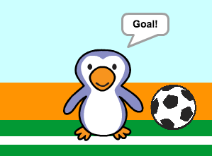

## Goal!

--- task ---

Can you play a sound and code your goalie to say 'Goal!' when a goal has been scored?

Remember that a goal has been scored if the ball is not touching the goalie.



--- hints ---

--- hint ---

`If the football is not`{:class="blockcontrol"} `touching the goalie`{:class="blocksensing"} your program should `play cheer`{:class="blocksound"} and `broadcast a goal message`{:class="blockevents"}.

`When the goalie receives the goal message`{:class="blockevents"} it should `say goal`{:class="blocklooks"}.

--- /hint ---

--- hint ---

You will need these blocks:

```blocks
broadcast [goal v]

say [Goal!] for (1) secs

when I receive [goal v]

play sound [cheer v]
```

--- /hint ---

--- hint ---

Your code should look like this:


```blocks
if <touching [goalie v]> then
play sound [rattle v]
broadcast [save v]
else
+ play sound [cheer v]
+ broadcast [goal v]
end
```


```blocks
when I receive [goal v]
say [Goal!] for (1) secs
```

--- /hint ---


--- /hints ---


--- /task ---
