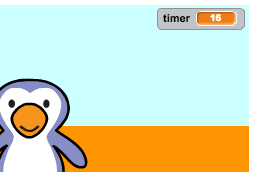

## Adding a timer

Let's add a timer, so that the player has to score as many goals as they can in 30 seconds.

--- task ---

`Make a new variable`{:class="blockdata"} called `timer`{:class="blockdata"}.

[[[generic-scratch3-add-variable]]]

--- /task ---

--- task ---

Click on your __stage__, and add this code to set the `timer`{:class="blockdata"} to 30 at the start of the game.


```blocks
when green flag clicked
set [timer v] to [30]
```

--- /task ---

--- task ---

Next, you'll need to add a `repeat until`{:class="blockcontrol"} block, so that the timer can run until it gets to 0.


```blocks
when green flag clicked
set [timer v] to [30]
+repeat until <(timer) = [0]>
end
```

--- /task ---

--- task ---

Reduce your timer by 1 every second until it reaches 0.


```blocks
when green flag clicked
set [timer v] to [30]
repeat until <(timer) = [0]>
+wait (1) secs
+change [timer v] by (-1)
end
```

--- /task ---

--- task ---

Once the timer has reached 0, you should play the 'whistle' sound and then stop the game.


```blocks
when green flag clicked
set [timer v] to [30]
repeat until <(timer) = [0]>
wait (1) secs
change [timer v] by (-1)
end
+play sound [whistle v] until done
+stop [all v]
```

--- /task ---

--- task ---

Click the green flag to test your code. Your timer should start at 30, and end at 0.



You can change your timer to start at 10 if you don't want to wait for 30 seconds!

--- /task ---

--- task ---

You only have the chance to score 1 goal! To have more than 1 chance, add a `forever`{:class="blockcontrol"} block around your __football__ code. You can also add a `wait`{:class="blockcontrol"} block between attempts.


```blocks
when green flag clicked
+forever
	go to x:(-200) y:(-140)
	repeat until <key [space v] pressed?>
		move (10) steps
		if on edge, bounce
	end
	repeat (15)
		change y by (10)
	end
	if <touching [goalie v]> then
		play sound [rattle v]
		broadcast [save v]
	else
		play sound [cheer v]
		broadcast [goal v]
	end
end
```

--- /task ---

